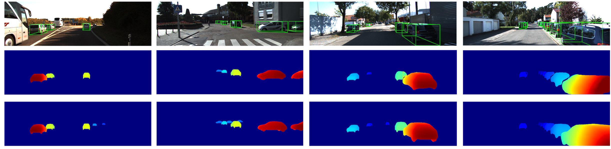

Update on 2021.2.4: New data, trained models, results and categories have been released! Old version data is not available now.
# Disp R-CNN: Stereo 3D Object Detection via Shape Prior Guided Instance Disparity Estimation (CVPR 2020)

This project contains the implementation of our CVPR 2020 paper [arxiv](https://arxiv.org/pdf/2004.03572.pdf).

Authors: Jiaming Sun, Linghao Chen, Yiming Xie, Siyu Zhang, Qinhong Jiang, Xiaowei Zhou, Hujun Bao.


<br/>


## Recommendations

- Ubuntu 18.04+
- Python 3.7+
- 8 Nvidia GPU with mem >= 12G (recommended, see [Notes](docs/TRAIN_VAL.md#Notes) for details.)
- GCC >= 7.5.0
- PyTorch 1.8.1+cu111
- cuda 11.3

## Install
```bash
# Install webp support
sudo apt install libwebp-dev
# Clone repo
git clone https://github.com/zju3dv/disprcnn.git
cd disprcnn
# Install python virtual environment
python -m venv disprcnn
source disprcnn/bin/activate
# Install Disp R-CNN
sh build_and_install.sh
```

## Training and evaluation
See [TRAIN_VAL.md](docs/TRAIN_VAL.md)

## Sample results



<br/>

## Citation

If you find this code useful for your research, please use the following BibTeX entry.

```
@inproceedings{sun2020disprcnn,
  title={Disp R-CNN: Stereo 3D Object Detection via Shape Prior Guided Instance Disparity Estimation},
  author={Sun, Jiaming and Chen, Linghao and Xie, Yiming and Zhang, Siyu and Jiang, Qinhong and Zhou, Xiaowei and Bao, Hujun},
  booktitle={CVPR},
  year={2020}
}
```

## Acknowledgment

This repo is built based on the Mask R-CNN implementation from [maskrcnn-benchmark](https://github.com/facebookresearch/maskrcnn-benchmark), and we also use the pretrained Stereo R-CNN weight from [here](https://drive.google.com/file/d/1rZ5AsMms7-oO-VfoNTAmBFOr8O2L0-xt/view?usp=sharing) for initialization.
The system architure figure is created with [Blender](https://www.blender.org/), feel free to reuse our [project file](https://mega.nz/file/Z1xhFSwD#tCYwKCGNaquv1pH6bbYe0hf_7AIs3yd53jg6_z3f_CU)! 

The original disp-rcnn code is modified in this branch to suite new GPU models which are not compatible with cuda 10 but cuda 11.1 or higher
Thanks to https://blog.csdn.net/weixin_43240386/article/details/123241585
We copied the code from https://gitee.com/qiancheng_sjtu/pointrcnn_cuda/tree/master/

Thanks to Yujie Xing for her help and trying to fix the cuda 11 compatibilty problem.


## Copyright
This work is affiliated with ZJU-SenseTime Joint Lab of 3D Vision, and its intellectual property belongs to SenseTime Group Ltd.

```
Copyright SenseTime. All Rights Reserved.

Licensed under the Apache License, Version 2.0 (the "License");
you may not use this file except in compliance with the License.
You may obtain a copy of the License at

    http://www.apache.org/licenses/LICENSE-2.0

Unless required by applicable law or agreed to in writing, software
distributed under the License is distributed on an "AS IS" BASIS,
WITHOUT WARRANTIES OR CONDITIONS OF ANY KIND, either express or implied.
See the License for the specific language governing permissions and
limitations under the License.
```


